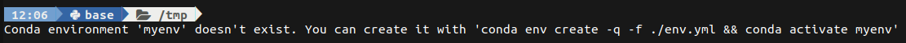

# auto_conda_synth_shell

  
Prettify & personalize your bash prompt and auto activate conda virtual environment!  

This is build over two projects that are not mine :  

- [synth-shell](https://github.com/andresgongora/synth-shell)  
- [conda_auto_env](https://albertotb.com/Git-prompt-with-conda-and-conda-auto-env/)  

## How to install

Open a terminal and execute the following instructions  

```bash
cd ~
cp ~/.bashrc ~/.bashrc.bak
git clone git@github.com:RivollierG/auto_conda_synth_shell.git
cd auto_conda_synth_shell
cat bashrc_add_on >> ~/.bashrc
```

Then close and reopen a terminal or run `source ~/.bashrc`.  

## How to uninstall

```bash
cd ~
rm -rf auto_conda_synth_shell
```

And then, optionally `cp ~/.basrc.bak ~/.bashrc` or open the ~/.basrc file and manually delete the 15 lines relative to auto\_conda\_synth\_shell at the end of the file.

## Install fonts

In order to print icons, you might need to install fonts.  
Many of the fonts support the icons, such as font-awesome.  
Here is how to install it with apt:  
```bash
sudo apt install fonts-font-awesome
sudo apt install fonts-octicons
```  
Then close and reopen your terminal.  

## How to use the auto_conda feature

In order to automatically activate your conda environment when changing directory, you need to have, in this directory, a file called env(ironment).y(a)ml or requirements.y(a)ml.  
The _name_ field of the file will be your environment name.  
If the environment does not exist, a warning is shown.  
For the YAML file creation, you can either create it manually or exporting an already existing conda environment.  

```bash
cd my_project
echo "name: myenv" > env.yml
# OR
conda activate myenv
conda env export -f env.yml
```

## Personalize

You can personalize your prompt by editing the synth-shell-prompt.config file.  
You can use supported color with their [8-bit codes](https://en.wikipedia.org/wiki/ANSI_escape_code#8-bit).  
Please see [synth-shell](https://github.com/andresgongora/synth-shell) for more information.  

## Modification

As written earlier, this is widely inspired from two other projects.  
Here is the main modify made:  

- From auto\_conda\_env, if the environment does not exist, there's no creation but a warning.  

- From synth_shell, here is only the synth-shell-prompt submodule.  
- Icons added : folder & home icons, python icon.  
- Icons modified : All git icons (green check mark, red blinking exclamation mark, up and down yellow/orage triangle).  
examples:  
 Everything is ok.  
 The git repo is 'dirty'.  
 The local branch is ahead (you have to `git push`).  
 The upstream branch is ahead (you have to `git pull`).  
  
## Note

- In order to track upstream branch, you have to set an upstream branch. You can do it with `git push --set-upstream origin <branch name>`.  
- In order to detect that you are behind the upstream branch or that you have diverge, you need to (regularly) run `git fetch`.  
- As I do not use terraform nor kubernetes, I have not played with those feature, but they are still here from [synth-shell](https://github.com/andresgongora/synth-shell).  
